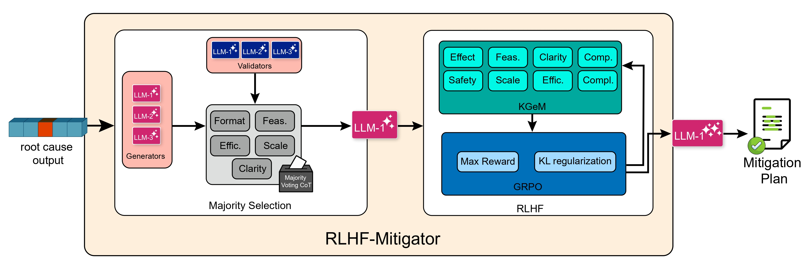

forked from https://github.com/phamquiluan/RCAEval 🕵️ RCAEval: A Benchmark for Root Cause Analysis of Microservice Systems


# ⚙️ ARMnet: Agentic Root Cause Analysis and Mitigation Network

**ARMnet** is an *agentic framework* that unifies **statistical** and **deep learning agents** to perform accurate and interpretable **Root Cause Analysis (RCA)** in microservice systems.  
It further introduces **🧠 RLHF-Mitigator**, an *agentic mitigation layer* that leverages **LLM judges** and **Reinforcement Learning from Human Feedback (RLHF)** to generate effective, context-aware mitigation plans.  
Together, they enable **scalable**, **adaptive**, and **autonomous** incident management across diverse architectures and fault scenarios.


---

## 🧩 DeepStat-RCA

### 🔹 Deep Learning RCA Agents
- Learn **complex, non-linear patterns** across **high-dimensional telemetry data**.  
- Deliver **precise** and **adaptive** fault localization.

### 🔹 Statistical RCA Agents
- Capture **causal dependencies**, **correlations**, and **system-level behaviors**.  
- Enable **interpretable** and **explainable** fault reasoning.


✨ *Together, these agents achieve superior accuracy, efficient training, and rapid inference — setting a benchmark future RCA systems must justify surpassing.*

---

## 🚀 RLHF-Mitigator: From Diagnosis to Action

ARMnet goes beyond fault detection with **RLHF-Mitigator**, a two-stage agentic layer for **autonomous mitigation**:

1. 🧑‍⚖️ **LLM Judge Agents** collaboratively evaluate candidate mitigation plans using a **majority-vote** mechanism.  
2. 🎯 **RLHF Fine-Tuning** refines the mitigation agent for **context-aware**, **operationally coherent** response generation.



---

## 📊 Experimental Insights

Extensive evaluations across diverse **datasets** and **microservice architectures** reveal that:

- **ARMnet** generalizes effectively across multiple deep learning paradigms and fault scenarios.  
- **RLHF-Mitigator** significantly outperforms standalone LLMs in producing **reliable** and **actionable** mitigation strategies.

---

## 🌐 Key Takeaway

**ARMnet / RMDnet** exemplifies the future of **agentic RCA and mitigation architectures**, where  
> 🧩 *Statistical reasoning*, 🤖 *Deep learning*, and 💬 *LLM-based collaboration*  
unite to deliver **scalable**, **adaptive**, and **autonomous** incident management in complex distributed environments.


**Table of Contents** 
  * [Prerequisites](#prerequisites)
  * [Installation](#installation)
  * [How-to-use](#how-to-use)
    + [Data format](#data-format)
    + [Basic usage example](#basic-usage-example)
  * [Available Datasets](#available-datasets)
  * [Licensing](#licensing)
  * [Acknowledgments](#acknowledgments)
  * [Contact](#contact)

## Prerequisites

We recommend using machines equipped with at least 8 cores, 16GB RAM, and ~50GB available disk space with Ubuntu 22.04 or Ubuntu 20.04, and **Python3.12**.

## Installation

The `default` environment, which is used for most methods, can be easily installed as follows. Detailed installation instructions for all methods are in [SETUP.md](docs/SETUP.md).


Open your terminal and run the following commands

```bash
sudo apt update -y
sudo apt install -y build-essential \
  libxml2 libxml2-dev zlib1g-dev \
  python3-tk graphviz
```

Clone ARMnet from GitHub

```bash
git clone https://github.com/theamrzaki/ARMnet.git && cd ARMnet
```

Create virtual environment with Python 3.12 (refer [SETUP.md](docs/SETUP.md) to see how to install Python3.12 on Linux)

```bash
python3.12 -m venv env
. env/bin/activate
```

## How-to-use

### Data format

The telemetry data must be presented as `pandas.DataFrame`. We require the data to have a column named `time` that stores the timestep. A sample of valid data could be downloaded using the `download_data()` or `download_multi_source_data()` method that we will demonstrate shortly below.

### Basic usage example

A basic example to use replicate the research questions of the journal paper
```shell
    ./RQ1_RQ2.sh
    ./RQ3.sh
```
To generate the graphs found in the paper use the scripts under 
```shell
    python ./script_graphs/RQ1.py

    python ./script_graphs/RQ2.py

    python ./script_graphs/RQ3_judges_consesus.py
    python ./script_graphs/RQ3_majority_voting.py
```


## Available Datasets

RCAEval benchmark includes three datasets: RE1, RE2, and RE3, designed to comprehensively support benchmarking RCA in microservice systems. Together, our three datasets feature 735 failure cases collected from three microservice systems (Online Boutique, Sock Shop, and Train Ticket) and including 11 fault types. Each failure case also includes annotated root cause service and root cause indicator (e.g., specific metric or log indicating the root cause). The statistics of the datasets are presented in the Table below.

|   Dataset   |   Systems  |   Fault Types            |   Cases  |   Metrics  |   Logs (millions)  |   Traces (millions)  |
|-------------|------------|--------------------------|----------|------------|--------------------|----------------------|
|   RE1       |   3        |   3 Resource, 2 Network  |   375    |   49-212   |   N/A              |   N/A                |
|   RE2       |   3        |   4 Resource, 2 Network  |   270    |   77-376   |   8.6-26.9         |   39.6-76.7          |


Our datasets and their description are publicly available in Zenodo repository with the following information:
- Dataset DOI: https://doi.org/10.5281/zenodo.14590730
- Dataset URL: [https://zenodo.org/records/14590730](https://zenodo.org/records/14590730)

In this work we only work with Online Boutique and Socket Shop and on 
metrics data 


## Licensing

This repository includes code from various sources with different licenses. We have included their corresponding LICENSE into the [LICENSES](LICENSES) directory:

- **RCAeval** (https://github.com/phamquiluan/RCAEval)
- **BARO**: Licensed under the [MIT License](LICENSES/LICENSE-BARO). Original source: [BARO GitHub Repository](https://github.com/phamquiluan/baro/blob/main/LICENSE).
- **Dlinear** (https://github.com/vivva/DLinear)
- **Fits** (https://github.com/VEWOXIC/FITS)
- **iTransformer** (https://github.com/thuml/iTransformer)
- **TimeMixer++** (https://github.com/kwuking/TimeMixer)
- **CausalRCA**: No License. Original source: [CausalRCA GitHub Repository](https://github.com/AXinx/CausalRCA_code).
- **CIRCA**: Licensed under the [BSD 3-Clause License](LICENSES/LICENSE-CIRCA). Original source: [CIRCA GitHub Repository](https://github.com/NetManAIOps/CIRCA/blob/master/LICENSE).
- **E-Diagnosis**: Licensed under the [BSD 3-Clause License](LICENSES/LICENSE-E-Diagnosis). Original source: [PyRCA GitHub Repository](https://github.com/salesforce/PyRCA/blob/main/LICENSE).
- **MicroCause**: Licensed under the [Apache License 2.0](LICENSES/LICENSE-MicroCause). Original source: [MicroCause GitHub Repository](https://github.com/PanYicheng/dycause_rca/blob/main/LICENSE).
- **RCD**: Licensed under the [MIT License](LICENSES/LICENSE-RCD). Original source: [RCD GitHub Repository](https://github.com/azamikram/rcd).
- **RUN**: No License. Original source: [RUN GitHub Repository](https://github.com/zmlin1998/RUN).

**For the code implemented by RCAeval and for their datasets, they distribute them under the [MIT LICENSE](LICENSE)**.

## Acknowledgments

We would like to express our sincere gratitude to RCAeval [https://github.com/phamquiluan/RCAEval] 
and to the researchers and developers who created the baselines used in our study. Their work has been instrumental in making this project possible. We deeply appreciate the time, effort, and expertise that have gone into developing and maintaining these resources. This project would not have been feasible without their contributions.

## Contact

[amrzaki\@yorku.ca](mailto:amrzaki@yorku.ca?subject=ARMnet)
